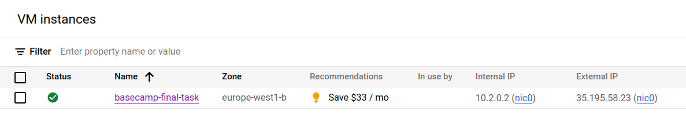
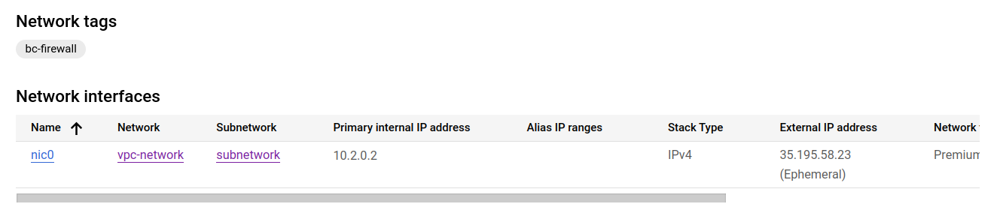
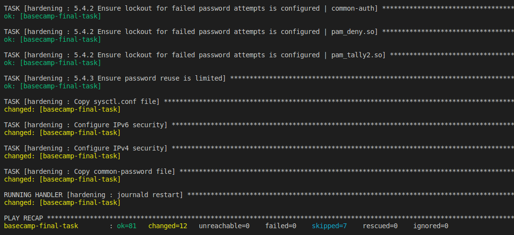
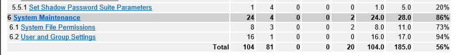
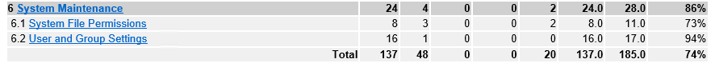

# Final Task

___Terraform:___
- create VPC in GCP/Azure
- create instance with External IP
- prepare managed DB (MySQL)

___Ansible:___
- perform basic hardening (keyless-only ssh, unattended upgrade, firewall)
- (optional) perform hardening to reach CIS-CAT score at least 80 (please find https://learn.cisecurity.org/cis-cat-lite)
- deploy K8s (single-node cluster via Kubespray)

___Kubernetes:___
- prepare ansible-playbook for deploying Wordpress
- deploy WordPress with connection to DataBase

============================================================================

## Terraform

For the first task, I created 3 terraform modules. The first creates a VPC in GCP, the second creates an instance (on which kubernetes cluster will be installed later), and the third creates a database.

As a result of execution, the following was created:
- vpc (network, sybnetwork, firewall, IP address, private connection);
- instance;
- datebase.

## Ansible

In the next step, I prepared an ansible role that improves the hardering of my virtual machine.

Before the role, the CIS-CAT security score was at the level of 56%.

And after hardening 74%.

